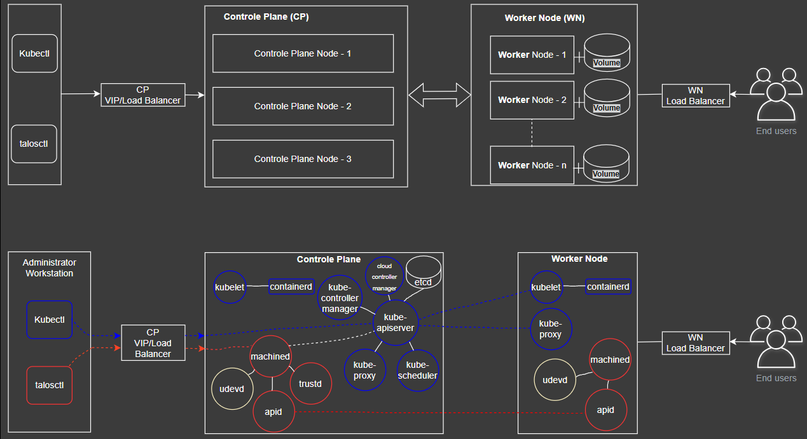
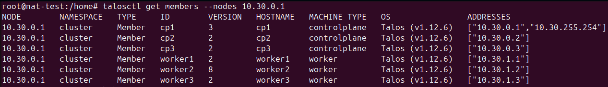
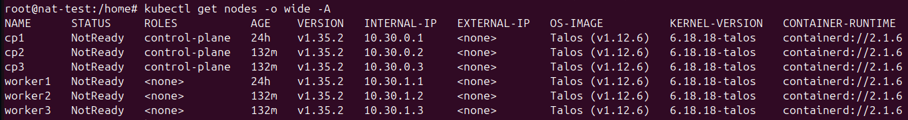
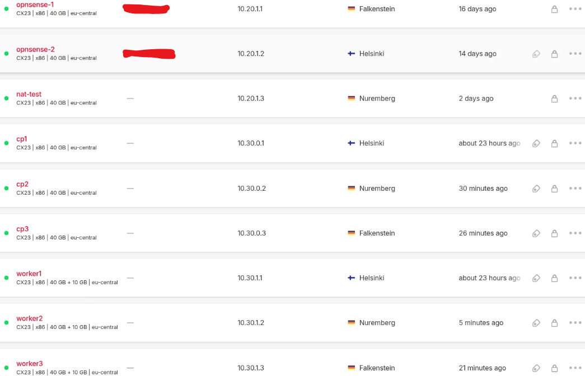
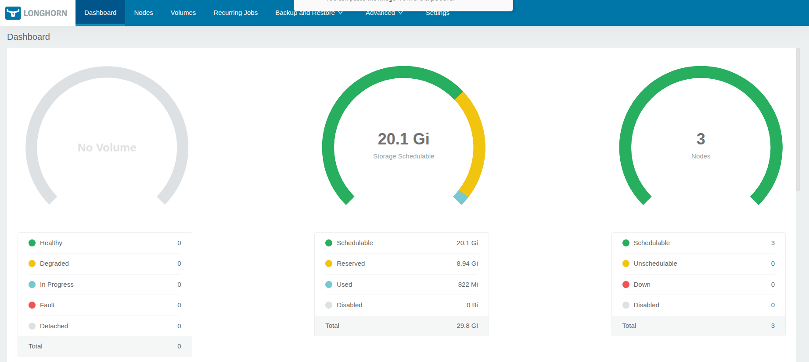
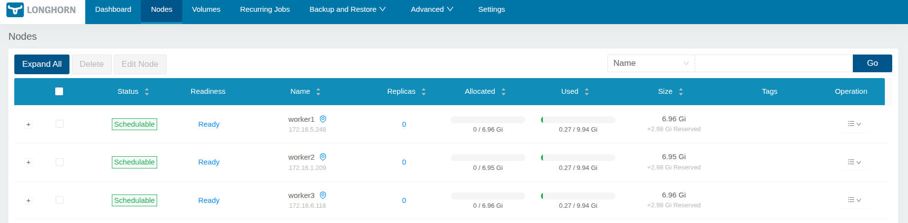

# talos-hetzner-k8s
Production-grade Kubernetes cluster on Hetzner Cloud using Talos Linux — private nodes behind HA OPNsense NAT, Cilium CNI with WireGuard encryption, Longhorn distributed storage on Hetzner attached volumes, Traefik ingress with automatic Hetzner Load Balancer, and cert-manager. Built manually without Terraform to understand every layer. Most Talos + Hetzner guides use Terraform modules that abstract everything. This repository documents the manual, step-by-step approach so you understand what every config key does, why each component exists, and how to debug when things break in production.

      

---

## Architecture

```
                          Internet
                             │
                     Hetzner Floating IP
                          95.x.x.x
                             │
              ┌──────────────┴──────────────┐
              │                             │
        OPNsense-1                   OPNsense-2
        10.20.1.1                   10.20.1.2
        (Primary NAT/Egress)       (Secondary NAT/Egress)
              │                             │
              └──────────────┬─────────────┘
                             │
              Hetzner Private Network 10.0.0.0/8
                       GW: 10.0.0.1
                             │
             ┌───────────────┼──────────────┐
             │               │              │
      Infra VMs         K8s Cluster     Jump Host
      10.20.x.x          10.30.x.x      10.20.1.2 
                             │
                ┌────────────┼────────────┐
                │            │            │
              cp1          cp2          cp3
           10.30.0.1    10.30.0.2    10.30.0.3
                │            │            │
           VIP: 10.30.255.254/32
           (Talos leader election + Hetzner alias IP)
         ----------------------------------------------
        |        ┌────────────┼────────────┐           |
        |        │            │            │           |                                                                                  
        |    worker1      worker2      worker3         |
        |   10.30.1.1    10.30.1.2    10.30.1.3        | <---- Traefik Ingress (Hetzner LB) <----Internet
        |    (hel1)       (nbg1)       (fsn1)          |                                          
        |        │            │            │           |
        |  Longhorn Vol   Longhorn Vol   Longhorn Vol  |
        |  Hetzner Vol    Hetzner Vol    Hetzner Vol   |
         ----------------------------------------------
```

--- 
**Traffic Flows**  
External User (Ingress):  
Internet → Hetzner LB (65.x.x.x) → Traefik (workers) → App Pod

Admin Access:  
Laptop → WireGuard VPN → OPNsense → Jump Host →  Private Network → VIP:6443 (kubectl) → 10.30.0.x:50000 (talosctl) 

Pod Egress (→ Internet):   
Pod → OPNsense NAT → Floating IP → Internet

---
## Stack
| Component    | Version | Purpose 
|--------------|---------|-------------------------------------------
| Talos Linux  | v1.12.6 | Immutable, API-driven OS — no SSH, no shell 
| Kubernetes   | v1.35.2 | Container orchestration 
| Cilium       | v1.19.2 | CNI + WireGuard pod/node encryption 
| Hetzner CCM  | v1.30.x | Cloud LB, node routes, node labels 
| Hetzner CSI  | latest  | Auto-provision Hetzner volumes via PVC 
| Longhorn     | v1.7.x  | Distributed block storage with UI 
| Traefik      | v3.x    | Ingress + auto Hetzner LB creation
| cert-manager | v1.20.x | Automatic SSL via Let's Encrypt
---
## Network Design

| Network         | CIDR               | Purpose 
|-----------------|--------------------|------------------------------
| Hetzner private | `10.0.0.0/8`       | All internal VM communication
| Infra VMs       | `10.20.0.0/16`     | OPNsense, jumphost, monitoring VMs
| K8s nodes       | `10.30.0.0/16`     | Control planes + worker nodes
| K8s VIP         | `10.30.255.254/32` | Control plane virtual IP (Hetzner Alias ip)
| Pod network     | `10.31.0.0/16`     | Cilium-managed pod IPs
| Service network | `10.32.0.0/16`     | ClusterIP services
| WireGuard VPN   | `172.16.11.0/24`   | Admin laptop VPN tunnel

---
## Encryption Status

| Layer                      | Status        | Method 
|----------------------------|---------------|---------------------------
| etcd data at rest          | ✅ Encrypted | secretbox AES (Talos default)
| etcd node communication    | ✅ Encrypted | TLS (Talos automatic)
| Talos API (port 50000)     | ✅ Encrypted | mTLS
| Kubernetes API (port 6443) | ✅ Encrypted | TLS
| Pod to Pod                 | ✅ Encrypted | WireGuard via Cilium 
| Node to Node               | ✅ Encrypted | WireGuard via Cilium 
| Ingress → User             | ✅ Encrypted | HTTPS via cert-manager
| Admin access               | ✅ Encrypted | WireGuard VPN
| Longhorn volume at rest    | ⚠️ Optional  | Longhorn crypto secret 
---
## Prerequisites

- HA OPNsense firewall running on `10.20.1.1` (NAT + WireGuard)
- Hetzner Cloud API token
- `talosctl` v1.12.6 + `kubectl` + `helm` on jump VM or management machine
- WireGuard VPN connected to OPNsense
---
### Step 0 — Environment variables or use .env for production use vault 
```bash
cd talos-hetzner-k8s/
export PROJECT_NAME=<Your-project-name>            # Choose a unique name for your project
export HCLOUD_TOKEN=<API-Tokens>                   # Replace with your actual Hetzner Cloud API token
export VIP=10.30.255.254                           # Talos VIP set according If you are using talos leder or use hetzner LB
hcloud context create $PROJECT_NAME
hcloud context list
echo "Project Name: $PROJECT_NAME"                 # To check variable and this export is store in ram until you close the terminal
```
### Step 1 — Hetzner Network
```bash
hcloud network create --name $PROJECT_NAME --ip-range 10.0.0.0/8
hcloud network add-subnet $PROJECT_NAME --type server --ip-range 10.20.1.0/24 --network-zone eu-central
hcloud network add-subnet $PROJECT_NAME --type server --ip-range 10.30.0.0/16 --network-zone eu-central
# Route all egress via OPNsense (already running at 10.20.1.1)
hcloud network add-route $PROJECT_NAME --destination 0.0.0.0/0 --gateway 10.20.1.1
```
## Network Architecture (OPNsense HA Setup)
**The Kubernetes cluster is deployed behind a highly available OPNsense firewall setup.
All control plane and worker nodes use private IP addresses, with OPNsense acting as the NAT gateway.
The setup includes floating IP failover, WireGuard VPN, OpenVPN, and HAProxy with SSL termination.
Refer to the following link for the complete configuration:
"https://github.com/NITISHMG/High-Availability-Firewall-on-Hetzner-Cloud-using-OPNsense"**
##################################################################################
> ⚠️ **For Testing**
> If you are **not using the OPNsense HA setup**, use a **NAT server instead** for outbound connectivity.
```bash
#Create vim nat-vm-cloud-init.yaml
# cloud-init for ubuntu 24.04
package_update: true
packages:
  - iptables-persistent

write_files:
  - path: /etc/networkd-dispatcher/routable.d/10-eth0-post-up
    permissions: '0755'
    content: |
      #!/bin/bash
      # Enable routing
      sysctl -w net.ipv4.ip_forward=1
      sysctl -w net.ipv4.conf.default.rp_filter=0
      sysctl -w net.ipv4.conf.all.rp_filter=0

      # NAT rule (USE YOUR CLUSTER CIDR)
      iptables -t nat -C POSTROUTING -s 10.20.0.0/16 -o eth0 -j MASQUERADE 2>/dev/null || \
      iptables -t nat -A POSTROUTING -s 10.20.0.0/16 -o eth0 -j MASQUERADE

runcmd:
  - bash /etc/networkd-dispatcher/routable.d/10-eth0-post-up
  - netfilter-persistent save
  - reboot
# Create NAT VM by below command or use Hetzner Console
hcloud ssh-key list
hcloud server create --name nat-vm --type cx23 --image  ubuntu-24.04  --user-data-from-file nat-vm-cloud-init.yaml --network $PROJECT_NAME --ssh-key "root@Test" 
```
### Step 2 — Build Custom Talos Image (Longhorn extensions required)
```bash
# Create schematic with iscsi-tools + util-linux-tools for Longhorn
curl -X POST https://factory.talos.dev/schematics \
  -H "Content-Type: application/json" \
  -d '{
    "customization": {
      "systemExtensions": {
        "officialExtensions": [
          "siderolabs/iscsi-tools",
          "siderolabs/util-linux-tools"
        ]
      }
    }
  }'
# Save the returned <schematic ID> 
# Create temporary VM (Ubuntu 24.04)on hetzner to generate talos snapshot
# Boot a Hetzner VM in rescue mode, flash image to disk
cd /tmp
wget -O /tmp/talos.raw.xz https://factory.talos.dev/image/<SCHEMATIC_ID>/v1.12.6/hcloud-amd64.raw.xz
xz -d -c /tmp/talos.raw.xz | dd of=/dev/sda bs=4M status=progress conv=fsync
sync 
shutdown -h now
# Take Hetzner snapshot → use as TALOS_IMAGE_ID for all nodes
export TALOS_IMAGE_ID=<snapshot-id>
```
### Step 3 — Generate Cluster Config
**talos-hetzner-k8s/patches/patch.yaml:**
[patch.yaml](patch/patch.yaml)

**talos-hetzner-k8s/patches/patch-cp.yaml:**
[patch-cp.yaml](patch/patch-cp.yaml)

```bash
talosctl gen secrets -o secrets.yaml
# VIP as endpoint
talosctl gen config $PROJECT_NAME https://10.30.255.254:6443 \
  --with-secrets secrets.yaml \
  --config-patch @patches/patch.yaml \
  --config-patch-control-plane @patches/patch-cp.yaml \
  --with-examples=false --with-docs=false \
  --force --output .
ls
controlplane.yaml secrets.yaml worker.yaml
```
### Step 4 — Create Servers (no public IP)

```bash
# Create servers for Control Plane on Hetzner cloud with 3 eu location
hcloud server create --name cp1 --image $TALOS_IMAGE_ID --type cx23 --label 'type=cp' --location hel1 --network $PROJECT_NAME --without-ipv4 --without-ipv6 --user-data-from-file controlplane.yaml
hcloud server create --name cp2 --image $TALOS_IMAGE_ID --type cx23 --label 'type=cp' --location nbg1 --network $PROJECT_NAME --without-ipv4 --without-ipv6 --user-data-from-file controlplane.yaml
hcloud server create --name cp3 --image $TALOS_IMAGE_ID --type cx23 --label 'type=cp' --location fsn1 --network $PROJECT_NAME --without-ipv4 --without-ipv6 --user-data-from-file controlplane.yaml

# Create servers for Worker Node on Hetzner cloud with 3 eu location
hcloud server create --name worker1 --image $TALOS_IMAGE_ID --type cx23 --label 'type=worker' --location hel1 --network $PROJECT_NAME --without-ipv4 --without-ipv6 --user-data-from-file worker.yaml
hcloud server create --name worker2 --image $TALOS_IMAGE_ID --type cx23 --label 'type=worker' --location nbg1 --network $PROJECT_NAME --without-ipv4 --without-ipv6 --user-data-from-file worker.yaml
hcloud server create --name worker3 --image $TALOS_IMAGE_ID --type cx23 --label 'type=worker' --location fsn1 --network $PROJECT_NAME --without-ipv4 --without-ipv6 --user-data-from-file worker.yaml  

# list server 
hcloud server list
```
### Step 5 — Add VIP Alias IP (before bootstrap)

```bash
# Do this BEFORE bootstrapping
# Makes 10.30.255.254 reachable on Hetzner private network
hcloud server change-alias-ips cp1 --network $PROJECT_NAME --alias-ips 10.30.255.254
#### For Production use Hetzner LB ###

**### NOTE: VIP unreachable after CP leader election changes Hetzner not auto assign alias to selected cp as leader**
# Find which CP holds VIP
talosctl get addresses \
  --nodes 10.30.0.1,10.30.0.2,10.30.0.3 | grep 10.30.255.254
# Update Hetzner alias IP to current VIP holder (e.g. cp3)
hcloud server change-alias-ips cp3 --network $PROJECT_NAME --alias-ips 10.30.255.254
```
### Step 6 — Bootstrap Cluster

```bash
talosctl config merge ./talosconfig
# config endpoint = where talosctl sends API requests
talosctl config endpoint 10.30.0.1 10.30.0.2 10.30.0.3 
# config node = which specific node to run commands 
talosctl config node 10.30.0.1
# endpoint = connection target, node = command target

# Run ONCE on ONE node only — never repeat
talosctl bootstrap --nodes 10.30.0.1
# watch health 
talosctl health --wait-timeout 15m
talosctl get members --nodes 10.30.0.1
```


### Step 7 — Install Cilium + WireGuard Encryption
[cilium-valurs.yaml](helm/cilium-values.yaml)
```bash
helm repo add cilium https://helm.cilium.io/ && helm repo update
helm install cilium cilium/cilium \
  --namespace kube-system \
  -f helm/cilium-values.yaml
# Get kubeconfig
talosctl kubeconfig
kubectl get nodes -o wide
# Verify
kubectl -n kube-system exec -it ds/cilium -- cilium encrypt status
# Expected: Encryption: Wireguard  Number of peers: 5
```


### Step 8 — Install Hetzner CCM + CSI
[hccm-values.yaml](helm/hccm-values.yaml)
```bash
kubectl create secret generic hcloud \
  --namespace kube-system \
  --from-literal=token=$HCLOUD_TOKEN \
  --from-literal=network=$PROJECT_NAME
kubectl get secrets -A

helm repo add hcloud https://charts.hetzner.cloud && helm repo update
helm install hccm hcloud/hcloud-cloud-controller-manager \
  --namespace kube-system \
  -f helm/hccm-values.yaml
# Install hetzner cloud csi for storage provisioning by hetzner
helm install hcloud-csi hcloud/hcloud-csi --namespace kube-system
```
### Step 9 — Attach Hetzner Volumes + Longhorn Machine Patch

```bash
# Create and attach volumes — one per worker, automount=false
hcloud volume create --size 10 --name worker1-longhorn-hel1 --location hel1
hcloud volume create --size 10 --name worker2-longhorn-nbg1 --location nbg1
hcloud volume create --size 10 --name worker3-longhorn-fsn1 --location fsn1

# Attach WITHOUT automount
hcloud volume attach worker1-longhorn-hel1 --server worker1 --automount=false
hcloud volume attach worker2-longhorn-nbg1 --server worker2 --automount=false
hcloud volume attach worker3-longhorn-fsn1 --server worker3 --automount=false
# List attached volumes
hcloud volume list
hcloud volume describe 

```
patch-worker1: [patches/longhorn/patch-worker1.yaml](patches/longhorn/patch-worker1.yaml)

patch-worker2: [patches/longhorn/patch-worker2.yaml](patches/longhorn/patch-worker2.yaml)

patch-worker3: [patches/longhorn/patch-worker3.yaml](patches/longhorn/patch-worker3.yaml)

**patches/longhorn/patch-worker1.yaml:**
```yaml
machine:
  disks:
    - device: /dev/disk/by-id/scsi-0HC_Volume_<Attached_volume_1_ID>     # Replace with correct volume ID
      partitions:
        - mountpoint: /var/lib/longhorn
          # Talos formats as XFS by default
  kubelet:
    extraMounts:
      - destination: /var/lib/longhorn
        type: bind
        source: /var/lib/longhorn
        options:
          - bind
          - rshared
          - rw
  sysctls:
    vm.max_map_count: "262144"    # required for Longhorn engine stability
```
--- 
## Apply patch per worker with correct volume device ID
```
talosctl apply-config --nodes 10.30.1.1 --file worker.yaml -p @patches/longhorn/patch-worker1.yaml
talosctl apply-config --nodes 10.30.1.2 --file worker.yaml -p @patches/longhorn/patch-worker2.yaml
talosctl apply-config --nodes 10.30.1.3 --file worker.yaml -p @patches/longhorn/patch-worker3.yaml
```


**Step 10 — Install Longhorn**
[longhorn-values.yaml](helm/longhorn-values.yaml)
```bash
helm repo add longhorn https://charts.longhorn.io && helm repo update
helm install longhorn longhorn/longhorn \
  --namespace longhorn-system --create-namespace \
  -f helm/longhorn-values.yaml

### To access longhorn internaly with vpn connection then use below patch as NodePort
kubectl -n longhorn-system patch svc longhorn-frontend -p '{"spec": {"type": "NodePort"}}'  
# If you not need longhorn-UI access make this as ClusterIP  
kubectl -n longhorn-system patch svc longhorn-frontend -p '{"spec": {"type": "ClusterIP"}}'
```
**# To access longhorn-ui http://node-privet-ip:NodePort**



**Step 11 — Install Traefik + cert-manager**
[traefik-values.yaml](helm/traefik-values.yaml)
[cert-manager-values.yaml)](helm/cert-manager-values.yaml)
```bash
helm repo add traefik https://helm.traefik.io/traefik && helm repo update
helm install traefik traefik/traefik \
  --namespace traefik --create-namespace \
  -f helm/traefik-values.yaml

# HCCM cannot add private worker node to Hetzner LB to connect privet ip do annotate 
kubectl annotate svc traefik -n traefik \
  load-balancer.hetzner.cloud/use-private-ip="true" \
  --overwrite

# Hetzner LB is auto-created — get public IP
kubectl get svc -n traefik   # EXTERNAL-IP = your LB IP
# Point all your domain DNS A records to this IP

# Install cert-manager
helm repo add jetstack https://charts.jetstack.io && helm repo update
helm install cert-manager jetstack/cert-manager \
  --namespace cert-manager --create-namespace  \
  -f helm/cert-manager-values.yaml
``` 
**### Create ClusterIssuer to issue TLS certificates across the entire cluster**

clusterissuer-staging: [manifests/clusterissuer-staging.yaml](manifests/clusterissuer-staging.yaml)

clusterissuer-prod: [manifests/clusterissuer-prod.yaml](manifests/clusterissuer-prod.yaml)
```
kubectl apply -f manifests/clusterissuer-staging.yaml
kubectl apply -f manifests/clusterissuer-prod.yaml
```
---

## Demo App
